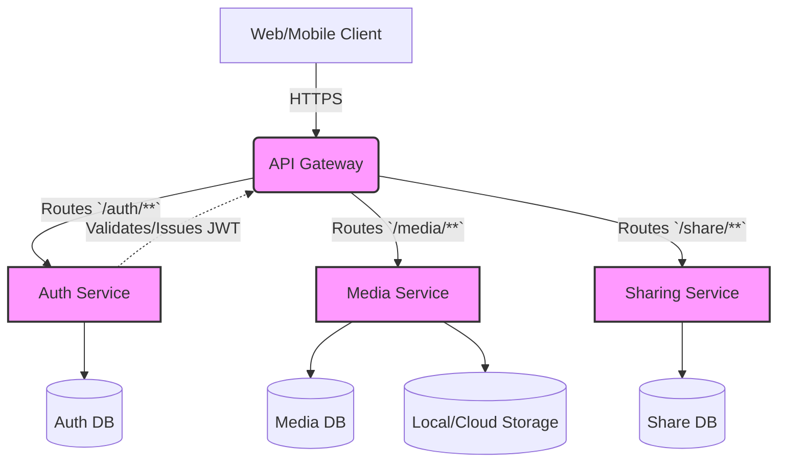
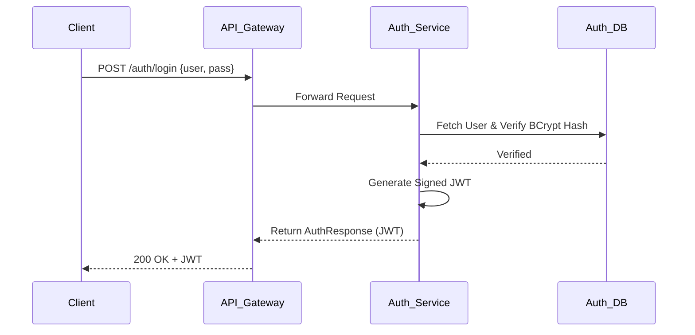
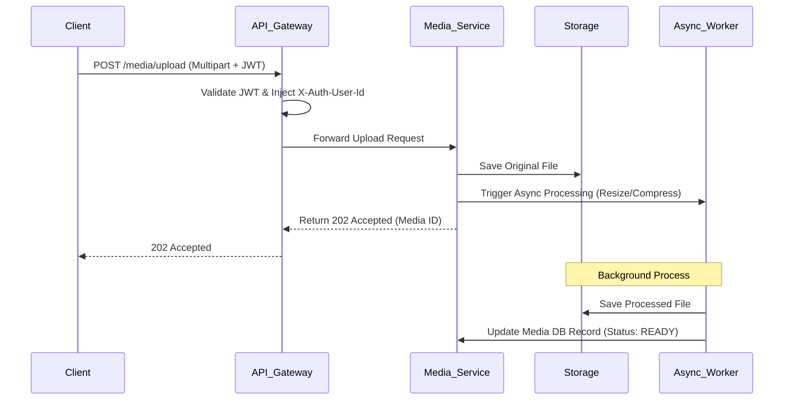
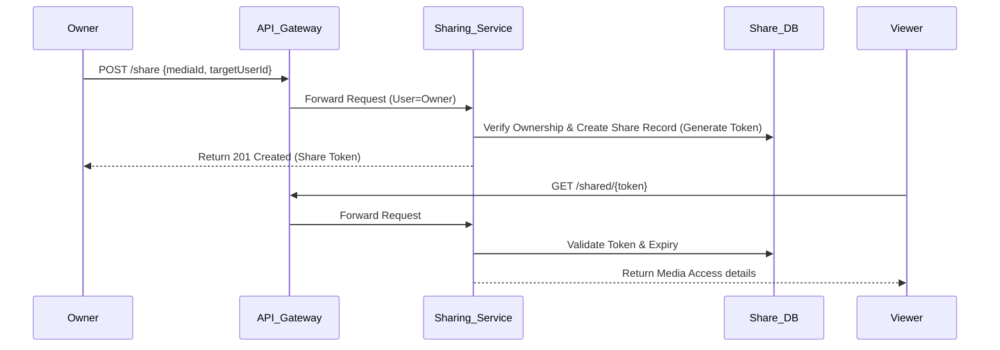

# Distributed Smart Media Processing & Sharing Platform

Welcome to the Distributed Smart Media Processing & Sharing Platform. This document outlines the architectural blueprint, system design, data flows, and engineering practices applied to build this scalable and robust microservices-based application.

## 🎯 System Overview

The platform provides a scalable infrastructure for users to securely upload, process, manage, and share media assets. Built on modern cloud-native principles, it leverages a microservices architecture to ensure high availability, fault tolerance, and decoupled scalability.

## 🏗️ High-Level System Architecture

The system is composed of several independent, specialized microservices communicating securely behind an API Gateway.

### Core Components
- **API Gateway (`api-gateway`)**: The single entry point for all client requests. Handles request routing, CORS configuration, and acts as a centralized authentication checkpoint (validating JWTs and propagating identity headers).
- **Auth Service (`auth-service`)**: Manages user identities, secure registration, credential verification, and JWT token issuance.
- **Media Service (`media-service`)**: The heavy-lifting engine responsible for handling multipart file uploads, asynchronous media processing (like image resizing via Thumbnailator or video thumbnail generation), and safe retrieval/deletion.
- **Sharing Service (`sharing-service`)**: Encapsulates the business logic for access control, peer-to-peer sharing permissions, and secure token-based public link generation.
- **Common Library (`common-lib`)**: A shared dependency ensuring cross-service consistency, housing standard DTOs, uniform API response formats, and centralized exception handlers.

## ⚙️ Professional Engineering Practices

The backend architecture incorporates several industry-standard software engineering practices:

- **Microservices Architecture**: Services are decoupled by domain (Authentication, Media, Sharing) to allow independent scaling and deployment.
- **Centralized API Gateway**: Implements the API Gateway pattern to abstract internal microservices, providing a unified frontend and handling cross-cutting concerns like authentication validation globally.
- **Shared Domain Libraries (`common-lib`)**: Enforces DRY (Don't Repeat Yourself) by sharing standardized response wrappers, constants, and custom exception hierarchies across all services.
- **Asynchronous Processing**: Intensive tasks, such as image resizing and thumbnail generation, are handled asynchronously (`@Async`) to ensure non-blocking, responsive API interactions for the end user.
- **Robust Security**: Passwords are securely hashed using `BCrypt`. All stateless service-to-service and client-to-service communications are secured via signed JSON Web Tokens (JWT).
- **Centralized Error Handling**: Utilizing `@ControllerAdvice` in the common library to trap exceptions universally and return consistent, well-formed error responses to clients.

## 🔄 Data Flow Explanations

### 1. Authentication Flow

### 2. Media Upload & Async Processing Flow

### 3. Secure Media Sharing Flow

## 👥 Team & Responsibilities
- **Yeabsira Belete**: `auth-service` (Security & User Identity)
- **Yeabsira Ayele**: `media-service` (Uploads & Processing Engine)
- **Yafet Mickael**: `sharing-service` (Permission Logic & Distribution)

---

## 🗓️ Execution Roadmap
1.  **Step 1**: Complete `common-lib` (DTOs & Exceptions).
2.  **Step 2**: Deploy `auth-service` (The backbone of security).
3.  **Step 3**: Deploy `media-service` (Core functionality).
4.  **Step 4**: Deploy `sharing-service` (The social/sharing layer).
5.  **Step 5**: Finalize `api-gateway` and End-to-End testing.
